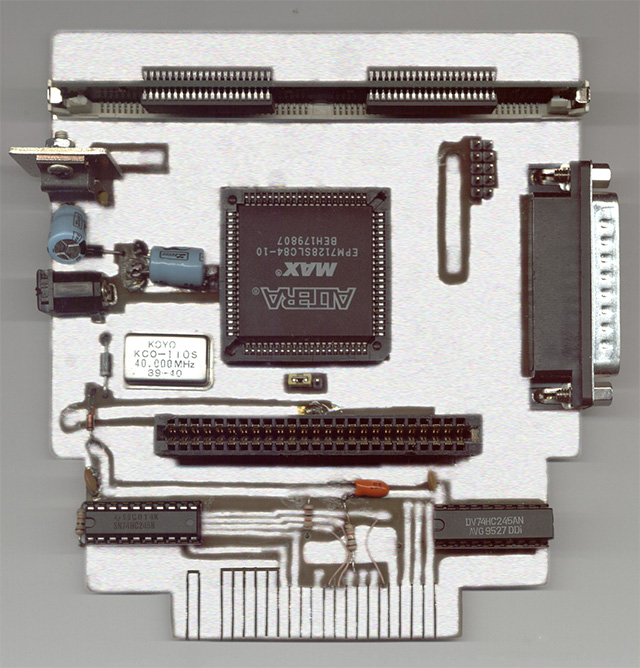

# PV-Backup

Hardware PC LPT interface to the Nintendo 64 game console. This device is similar to DrJr or V64Jr 

DIY PCB prototype board

## Folders

- *doc* Documentation
- *pld* Source code of PLD (Programming Logic Device)
- *sch-pcb* Sources for schematic circuit diagram and PCB
- *soft* Source code additional software
